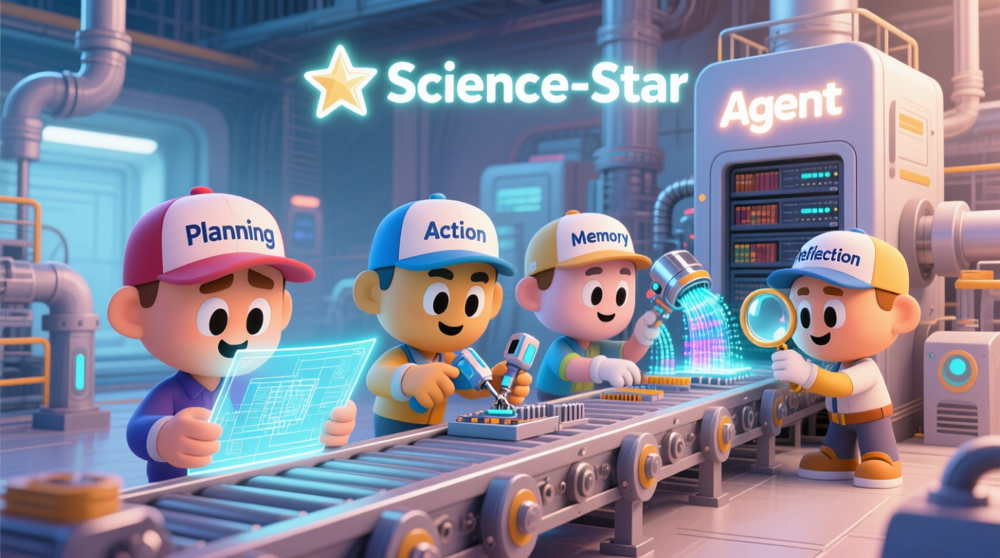
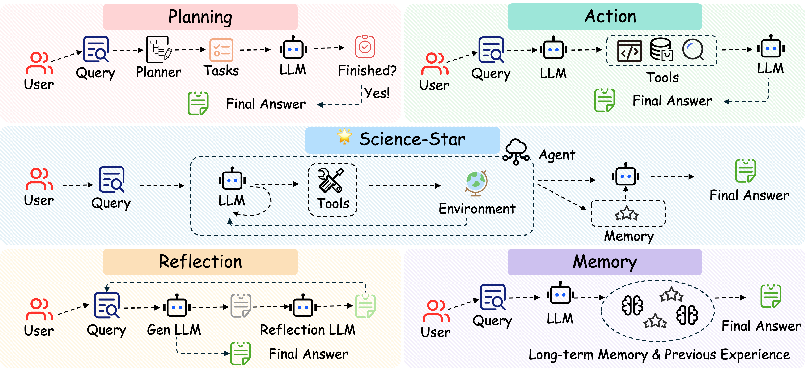

<h1 align="center"> 🌟 Science-Star: An Open Platform for Building, Extending, and Experimenting with Scientific Agents. </h1>

<p align="center">
  <a href="https://github.com/Melmaphother/Science-Star/stargazers"></a>
  <a href="https://github.com/Melmaphother/Science-Star/network/members"></a>
  <a href="https://github.com/Melmaphother/Science-Star/blob/main/assets/wechat.jpeg"></a>
</p>

<p align="center">
<br>
<i>Generated by Qwen Image.</i>
</p>

## 📢 News

<details open>
<summary><b>Recent Updates</b></summary>

- [2025.08.21] **Science-Star Init**: We release Science-Star. It is an user-friendly open platform for building, extending, and experimenting with scientific agents.

</details>

## 🧠 Overview

We introduce **Science-Star**, the open-source framework built to revolutionize how we build, extend, and experiment scientific AI agents. Frustrated by the limitations of existing tools, we engineered Science-Star to be intuitive yet powerful. At its core, Science-Star combines a robust **ReAct-based engine** with essential features like Planning, Action, Memory and Reflection, integrated **HLE dataset support**, and **powerful visualization tools**. It's an all-in-one platform designed to get your ideas from concept to reality, faster than ever. Whether you are a seasoned researcher or a curious developer, Science-Star provides the tools you need to push the boundaries of science. The next breakthrough is waiting. Let's build it together. Join the Science-Star community today!

> **Also check out [Awesome-Agent-Craft](https://github.com/Melmaphother/Awesome-Agent-Craft)**: Our curated collection of papers and benchmarks on unlocking the potential of Scientific AI Agents.

<p align="center"></p>

## 🔥 Key Features

- **Integrated Visualization**: An end-to-end, extensible visualization suite powered by [streamlit](https://github.com/streamlit/streamlit). It streamlines the entire workflow from data inspection and real-time experiment monitoring to results logging and analysis.

- **Plug-and-Play Modularity**: Core components (`dataloader`, `memory`, `planner`, `tool`, `evaluator`) are designed with well-defined interfaces. This modularity enables effortless substitution and customization.

- **Scientific Extensibility**: Science-Star has built-in support for advanced retrieval and literature-based Retrieval-Augmented Generation (RAG).

## 🚩 Incoming Features

- **More Scientific Extensibility**: We will add more tools for seamless integration of specific scientific tools (e.g., Chemistry, Biology).

- **More Architectures Support**: We will support more agent architectures outside the ReAct framework.

- **More Tasks and Datasets Support**: We will support more agent datasets and tasks, like GAIA etc.

## 🚀 Easy Experiments

- [Brief Project Structure](https://github.com/Melmaphother/Science-Star/blob/main/docs/project_structure.md)
- [Environment Setup](https://github.com/Melmaphother/Science-Star/blob/main/docs/installation.md)
- [Quick Start: Try o4-mini + ReAct on HLE-Small](https://github.com/Melmaphother/Science-Star/blob/main/docs/quickstart.md)

## 🛠️ Extending Science-Star with Your Own Tools and Workflows

Additional resources are available in the codebase:

- Example tools: `science_star/tools/`
- Data preprocessing: `science_star/data_utils`
- Visualization: `visualization/vis_xx`

## 🧪 Experimental Results

Using o4-mini-2025-04-16 as our base model, we have achieved **state-of-the-art (SOTA)** results on a small-scale HLE dataset by implementing an **end-to-end pipeline** that leverages the **ReAct** framework with integrated **planning, action, memory and reflection** modules. The project requires further testing and refinement. We invite the open-source community to join us in shaping the future of this work. Let's build together!

## ℹ️ Feedback

We welcome all forms of feedback! Please raise an issue for bugs, questions, or suggestions. This helps our team address common problems efficiently and builds a more productive community.

**Join our community**: Connect with other users and our development team in our [WeChat group](https://github.com/Melmaphother/Science-Star/blob/main/assets/wechat.jpeg).

## 🤝 Contributors

**Student Contributors**: [**Daoyu Wang**](https://github.com/Melmaphother), [**Qingchuan Li**](https://github.com/wufeiwuwoshihua), [**Tian Gao**](https://github.com/SkyeGT), [**Shuo Yu**](https://github.com/fishsure), [**Xiaoyu Tao**](https://github.com/Xiaoyu-Tao), [**Ze Guo**](https://github.com/Kawai1Angel)

**Supervisors**: [**Qi Liu**](http://staff.ustc.edu.cn/~qiliuql/), [**Mingyue Cheng**](https://mingyue-cheng.github.io/)

**Affiliation**: **State Key Laboratory of Cognitive Intelligence, University of Science and Technology of China**

## 🥰 Acknowledgements

We extend our gratitude to [OAgent](https://github.com/OPPO-PersonalAI/OAgents) for providing the OAgent and hard work in engineering. We are also thankful to the [smolagent](https://github.com/huggingface/smolagents) team for their fundamental support. Lastly, we deeply appreciate the insightful discussions and contributions from Daoyu Wang, Qingchuan Li, Tian Gao, Shuo Yu, Xiaoyu Tao, Ze Guo.

## ✍️ Citation

**Science-Star**

```md
@misc{Science-Star,
author = {Daoyu Wang, Qingchuan Li, Tian Gao, Shuo Yu, Xiaoyu Tao, Mingyue Cheng, Qi Liu},
title = {Science-Star: An Open Platform for Building, Extending, and Experimenting with Scientific Agents.},
year = {2025},
organization = {GitHub},
url = {https://github.com/Melmaphother/Science-Star},
}
```
