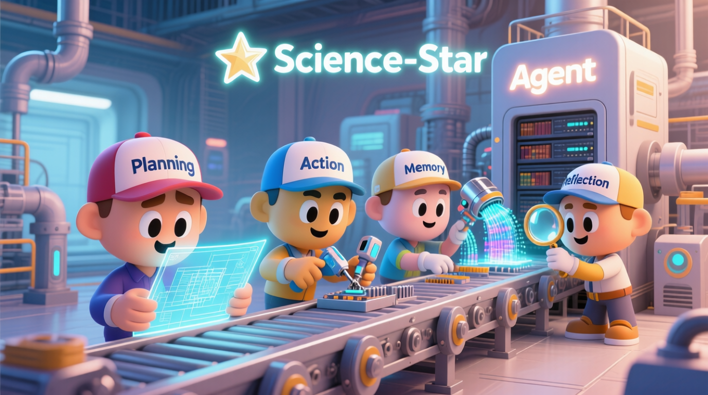
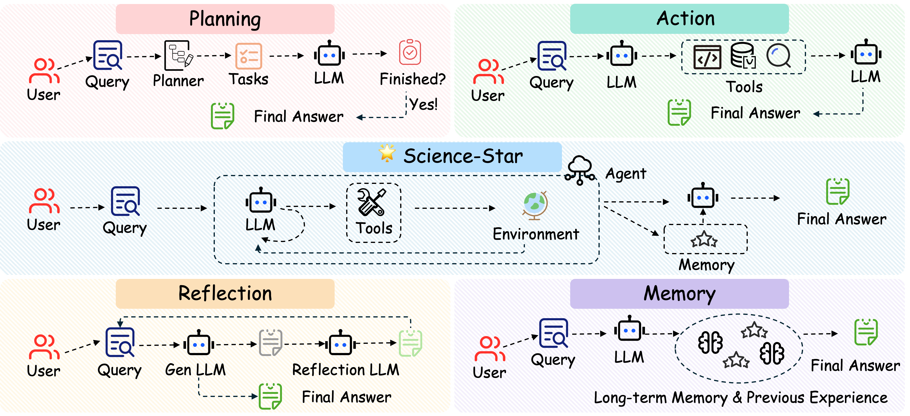

<h1 align="center">🌟 Science-Star — Your Scientific AI Agents</h1>

<p align="center"><i>Build, extend, and experiment with scientific agents. One platform. Zero friction.</i></p>

<p align="center">
  <a href="https://github.com/Melmaphother/Science-Star/stargazers"></a>
  <a href="https://github.com/Melmaphother/Science-Star/network/members"></a>
</p>

<p align="center">
<br>
<i>Generated by Qwen Image.</i>
</p>

## 📢 News

<details open>
<summary><b>Recent Updates</b></summary>

- [2026.02] **Major Update**: More benchmark support, multi-agent architecture (CodeAgent + search agent), refactored run scripts (`run_multi_agent.py` / `run_single_agent.py`), and streamlined project structure.
- [2025.08] **Science-Star Init**: We release Science-Star — an open platform for building, extending, and experimenting with scientific agents.

</details>

## 🧠 Overview

**Science-Star** is your open-source platform for scientific AI agents. Built on the **ReAct** engine with Planning, Action, Memory, and Reflection, it ships with **Humanity's Last Exam (HLE)** and **GAIA** benchmarks, rich tooling (search, crawl, PDF, browser, RAG), and end-to-end visualization. One command to run, one platform to extend—whether you're a researcher or a developer, Science-Star gets you from idea to experiment, fast.

> **Also check out [Awesome-Agent-Craft](https://github.com/Melmaphother/Awesome-Agent-Craft)**: Our curated collection of papers and benchmarks on unlocking the potential of Scientific AI Agents.

<p align="center"></p>

## 🔥 Key Features

- **🔧 Rich Toolbox** — Search (SerpAPI, Tavily, DuckDuckGo, Wayback), crawl (Jina, crawl4ai), PDF parser, browser use, inspector (doc/audio/visual), retriever (RAG), code execution. Add yours via a clean interface.
- **🤖 Multi-Agent & Modular** — CodeAgent + search agent out of the box. One config to switch single ↔ multi. Swap loaders, models, tools—core logic stays untouched.
- **📊 HLE & GAIA + Viz** — One-click benchmarks with loaders and scorers. Streamlit dashboards for data exploration and result analysis. Zero setup.

## 🚩 Roadmap

- **Domain Tools**: Chemistry, Biology, and other scientific toolkits
- **More Architectures**: Beyond ReAct—new agent paradigms
- **More Benchmarks**: Additional datasets and evaluation suites

## 🚀 Get Started

1. **Configure environment** — conda, smolagents, API keys, and tests. → [Installation](https://github.com/Melmaphother/Science-Star/blob/main/docs/installation.md)
2. **Run experiments** — HLE & GAIA in one command, customize configs, launch visualization dashboards. → [Quick Start](https://github.com/Melmaphother/Science-Star/blob/main/docs/quickstart.md)
3. **Explore the architecture** — tools, loaders, RAG, configs, and how they connect. → [Project Structure](https://github.com/Melmaphother/Science-Star/blob/main/docs/project_structure.md)

## 🛠️ Extend

- **Tools**: `science_star/tools/` — search, crawl, PDF, browser, retriever
- **Loaders**: `data/hle_loader.py`, `data/gaia_loader.py`
- **Viz**: `visualization/vis_dataset.py`, `visualization/vis_output.py`

## 🧪 Experimental Results

Using o4-mini-2025-04-16 as our base model, we have achieved leading results on a small-scale HLE dataset by implementing an **end-to-end pipeline** that leverages the **ReAct** framework with integrated **planning, action, memory and reflection** modules. The project requires further testing and refinement. We invite the open-source community to join us in shaping the future of this work. Let's build together!

## ℹ️ Feedback

We welcome all forms of feedback! Please raise an issue for bugs, questions, or suggestions. This helps our team address common problems efficiently and builds a more productive community.

## 🤝 Contributors

**Student Contributors**: [**Daoyu Wang**](https://melmaphother.github.io), [**Qingchuan Li**](https://github.com/qingchuanli), [**Tian Gao**](https://github.com/SkyeGT), [**Shuo Yu**](https://fishsure.github.io), [**Xiaoyu Tao**](https://Xiaoyu-Tao.github.io), [**Ze Guo**](https://github.com/Kawai1Angel)

**Supervisors**: [**Qi Liu**](http://staff.ustc.edu.cn/~qiliuql/), [**Mingyue Cheng**](https://mingyue-cheng.github.io/)

**Affiliation**: **State Key Laboratory of Cognitive Intelligence, University of Science and Technology of China**

## 🥰 Acknowledgements

We extend our gratitude to [OAgent](https://github.com/OPPO-PersonalAI/OAgents) for providing the OAgent and hard work in engineering. We are also thankful to the [smolagent](https://github.com/huggingface/smolagents) team for their fundamental support. Lastly, we deeply appreciate the insightful discussions and contributions from Daoyu Wang, Qingchuan Li, Tian Gao, Shuo Yu, Xiaoyu Tao, Ze Guo.

## ✍️ Citation

**Science-Star**

```md
@misc{Science-Star,
author = {Daoyu Wang, Qingchuan Li, Tian Gao, Shuo Yu, Xiaoyu Tao, Mingyue Cheng, Qi Liu},
title = {Science-Star: An Open Platform for Building, Extending, and Experimenting with Scientific Agents.},
year = {2025},
organization = {GitHub},
url = {https://github.com/Melmaphother/Science-Star},
}
```
