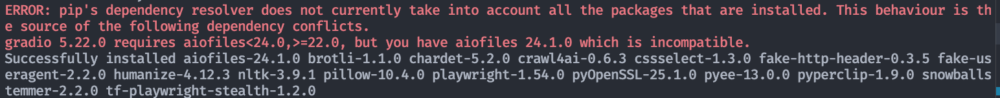
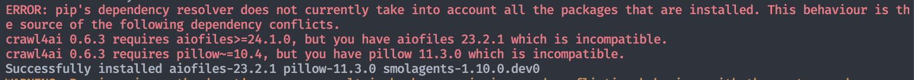

### Environment Setup

**Clone the repository**
```bash
git clone git@github.com:Melmaphother/Open-Agent.git
cd Open-Agent/
```

**Install dependencies**
```bash
# Create the conda environment
conda create -n open-agent python==3.10
conda activate open-agent
# Install the required dependencies from the requirements.txt
pip install -r requirements.txt
pip install crawl4ai==0.6.3
pip install langchain==0.3.23
# Install smolagents
cd src
pip install -e ./.[dev]
```

## Common Installation Errors

During the installation process, you may encounter the following errors, which are normal:

### Error 1: Possible errors when running `pip install crawl4ai`



### Error 2: Possible errors when running `pip install -e ./.[dev]`



**Important Note:** As long as you see "Successfully installed" at the end, the installation was successful and you can ignore the above error messages. These errors are typically due to dependency conflicts or warning messages and will not affect the normal operation of the software.